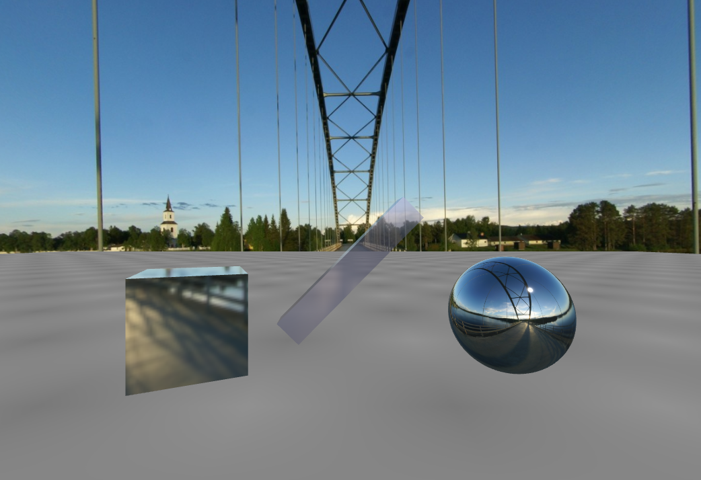
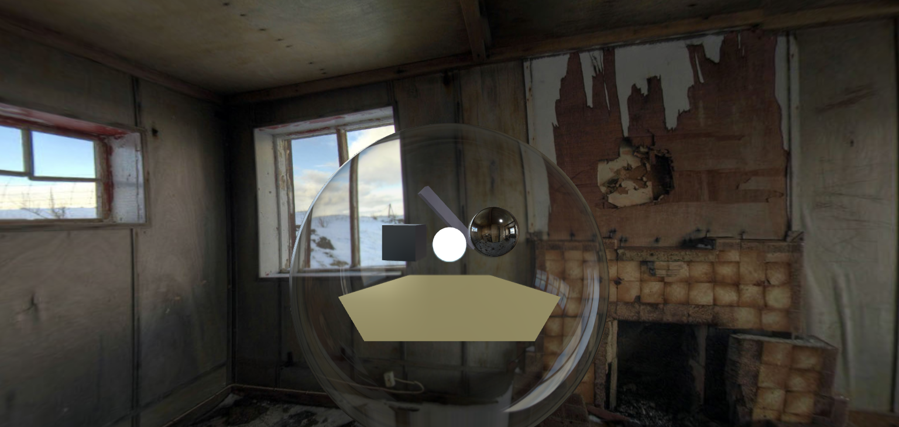
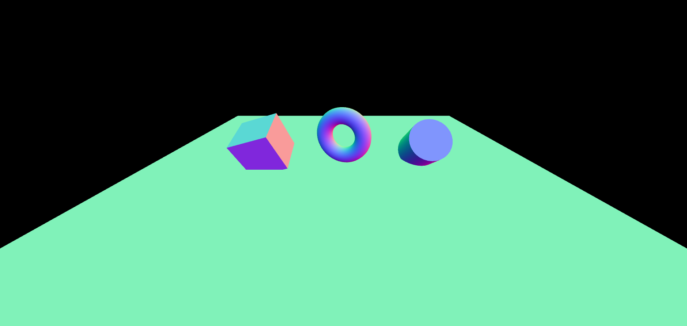

# Three.js Creative Scenes Showcase

A collection of 3D scenes built with [Three.js](https://threejs.org/) demonstrating different materials, lighting, and reflections in immersive environments. Click the links below to preview each project.

---

## 🔮 1. Mirror Sphere with HDR Environment

This scene showcases physically-based rendering (PBR) using a mirror-like reflective sphere, a transparent glass bar, and realistic lighting with an outdoor HDR background.

**Code**: [`index.html`](./mirror-sphere/index.html)  

---

## 🏚️ 2. Old House Reflection Scene

A mysterious indoor setup using HDR environment mapping inside a weathered room, with reflective and glass materials demonstrating light interaction in enclosed spaces.

**Code**: [`index.html`](./old-house/index.html)  

---

## 🧊 3. Colorful Geometry Playground

A simple interactive scene with basic shapes (cube, torus, and cylinder) rendered in vibrant color gradients, designed for experimenting with geometry, lighting, and shading.

**Preview**: [`index.html`](./geometry-playground/index.html)  

